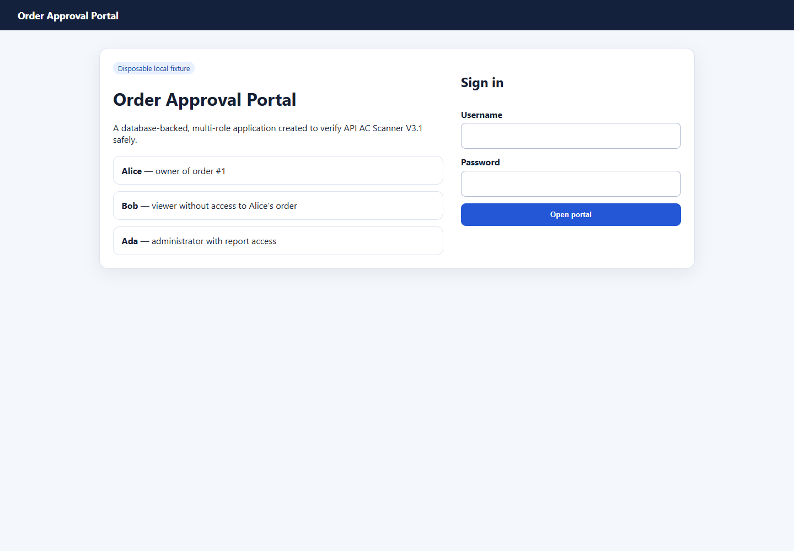
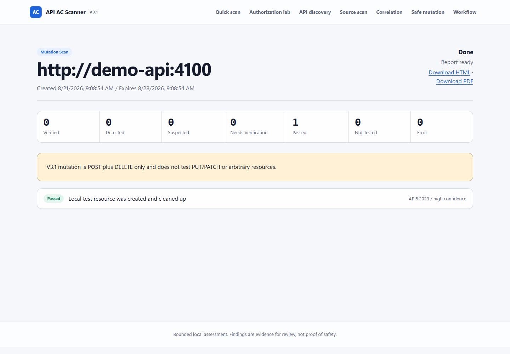
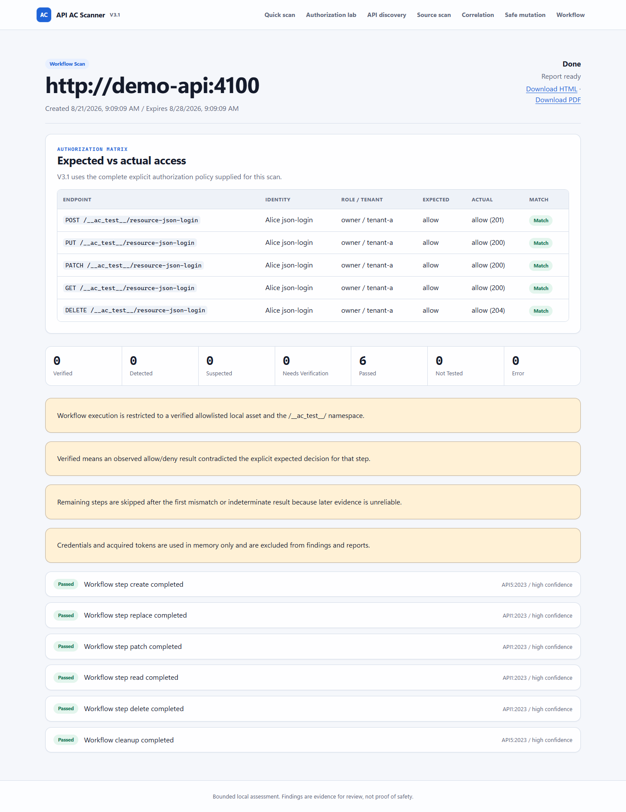

# คู่มือใช้งาน API Access-Control Scanner V3.1

คู่มือนี้อธิบายการใช้งานตั้งแต่เปิดระบบครั้งแรก ไปจนถึง Quick Scan, Deep Scan, Safe Mutation, Guarded Workflow และการอ่านรายงาน โดยตัวอย่างที่มีการแก้ไขข้อมูลจะใช้เฉพาะ Docker Demo Lab ซึ่งเป็นระบบชั่วคราวภายในเครื่อง

> ใช้ scanner เฉพาะระบบที่คุณเป็นเจ้าของหรือได้รับอนุญาตอย่างชัดเจนเท่านั้น ห้ามใช้บัญชีจริง ข้อมูลจริง หรือ path ที่อาจกระทบ production กับ Mutation และ Workflow

## 1. สิ่งที่ต้องมี

- Windows 10/11
- Docker Desktop ซึ่งเปิดใช้งาน Linux containers
- Docker Compose V2
- พื้นที่ว่างสำหรับ image ของ web, scanner, Node.js และ PostgreSQL

โฟลเดอร์โปรเจกต์คือ:

```text
D:\api-ac-scanner\api-ac-scanner V3.1
```

## 2. เปิดระบบครั้งแรก

1. เปิดโฟลเดอร์โปรเจกต์
2. ดับเบิลคลิก `run.bat`
3. เลือก `1) Setup`
4. ระบบจะสร้างหรือเปิดไฟล์ `.env`
5. เก็บค่า `ADMIN_USERNAME` และ `ADMIN_PASSWORD` ไว้ใช้เข้าสู่ Owner Workspace
6. ห้ามส่งไฟล์ `.env`, session secret หรือ scanner token ให้ผู้อื่น
7. กลับมาที่เมนูแล้วเลือก `2) Build`
8. เมื่อ build สำเร็จ เลือก `3) Start`
9. เลือก `6) Status` ทุก service ควรแสดงสถานะ healthy
10. เลือก `8) Open` หรือเปิด `http://127.0.0.1:3000`

คำสั่งทางเลือกสำหรับ PowerShell:

```powershell
Set-Location 'D:\api-ac-scanner\api-ac-scanner V3.1'
docker compose up -d --build
docker compose ps
```

## 3. เมนูหลักของผลิตภัณฑ์

| เมนู | ใช้ทำอะไร | ต้องเข้าสู่ระบบ |
| --- | --- | --- |
| Quick scan | ตรวจ surface แบบไม่มี credential ด้วยคำขอที่ถูกจำกัด | ไม่ต้อง |
| Authorization lab | ทดสอบ BOLA/BFLA ด้วย identity สองชุดและ policy ที่ระบุเอง | ต้อง |
| API discovery | อ่าน OpenAPI, HAR, Postman หรือ source route แล้วสร้าง endpoint inventory | ต้อง |
| Source scan | ตรวจ source code แบบ static และรายงานตำแหน่งที่ควรตรวจต่อ | ต้อง |
| Correlation | เชื่อมหลักฐาน source scan กับ deep scan ตาม endpoint | ต้อง |
| Safe mutation | POST resource ชั่วคราวแล้ว DELETE cleanup | ต้อง |
| Workflow | รัน GET/POST/PUT/PATCH/DELETE ตามลำดับสูงสุด 8 ขั้น | ต้อง |

## 4. Quick Scan

Quick Scan เหมาะสำหรับตรวจว่าเป้าหมายตอบสนองหรือไม่ ดู security headers และ method surface เบื้องต้น โดยไม่มี token และไม่ส่ง mutation

1. เปิด `http://127.0.0.1:3000`
2. กรอก URL เต็มในช่อง `Target URL`
3. เลือกช่องยืนยันว่าคุณเป็นเจ้าของหรือได้รับอนุญาต
4. กด `Run quick scan`
5. รอจนสถานะเปลี่ยนเป็น `Done / Report ready`
6. เปิด finding แต่ละรายการเพื่อดู Evidence และ Recommended verification

ข้อจำกัดสำคัญ:

- Quick Scan ไม่สามารถยืนยัน BOLA เพราะไม่มีผู้ใช้สองบัญชี
- Quick Scan ไม่สามารถยืนยัน BFLA เพราะไม่มีข้อมูล role
- `0 Detected` ไม่ได้แปลว่า API ปลอดภัย
- Path ที่ตอบ `200` อาจเป็น public route หรือ fallback page จึงอาจถูกจัดเป็น `suspected`

## 5. เปิด Docker Demo Lab

Demo Lab คือ Order Approval Portal ที่มีหน้าเว็บ, PostgreSQL, ผู้ใช้หลาย role และ disposable API สำหรับพิสูจน์ V3.1 โดยไม่แตะ production

1. เปิด `run.bat`
2. เลือก `9) Demo Lab`
3. รอจนระบบแจ้งว่าเริ่มสำเร็จ
4. เปิด Order Portal ที่ `http://127.0.0.1:4100`
5. เปิด Scanner ที่ `http://127.0.0.1:3000`

บัญชีจำลอง:

| ผู้ใช้ | รหัสผ่าน | Role | สิทธิ์หลัก |
| --- | --- | --- | --- |
| `alice` | `alice-password` | owner | อ่าน order ของ Alice และใช้ owner function |
| `bob` | `bob-password` | viewer | อ่าน order ของ Bob แต่ห้ามอ่าน order ของ Alice |
| `admin` | `admin-password` | admin | อ่านทุก order และ admin report |



## 6. เพิ่ม Demo Lab เป็น Verified Asset

1. ที่ Scanner เลือก `Authorization lab`
2. เข้าสู่ระบบด้วย `ADMIN_USERNAME` และ `ADMIN_PASSWORD` จาก `.env`
3. ในหัวข้อ `Add your local or staging API` กรอก:

```text
http://demo-api:4100
```

4. กด `Add asset`
5. asset ควรขึ้นสถานะ `Verified` อัตโนมัติ เพราะ `demo-api` อยู่ใน local allowlist

อย่าใช้ `http://127.0.0.1:4100` เป็น scanner target ภายใน Docker เพราะ `127.0.0.1` ของ scanner container หมายถึงตัว scanner เอง ไม่ใช่ Order Portal

## 7. ทดสอบ BOLA: Alice กับ Bob

เป้าหมายคือพิสูจน์ว่า Alice อ่าน order #1 ได้ แต่ Bob และ Anonymous ถูกปฏิเสธ

1. เปิด `Authorization lab`
2. เลือก asset `http://demo-api:4100`
3. กรอก Object paths:

```text
/api/orders/1
```

4. กรอก Admin/function paths:

```text
/api/owner/summary
```

5. กรอก Explicit authorization policy:

```json
[
  {"method":"GET","path":"/api/orders/1","identity":"Alice Owner","expected":"allow"},
  {"method":"GET","path":"/api/orders/1","identity":"Bob Viewer","expected":"deny"},
  {"method":"GET","path":"/api/orders/1","identity":"Anonymous","expected":"deny"},
  {"method":"GET","path":"/api/owner/summary","identity":"Alice Owner","expected":"allow"},
  {"method":"GET","path":"/api/owner/summary","identity":"Bob Viewer","expected":"deny"},
  {"method":"GET","path":"/api/owner/summary","identity":"Anonymous","expected":"deny"}
]
```

6. Baseline / owner profile:

```text
Profile label:       Alice Owner
Expected role:       owner
Tenant / scope:      tenant-a
Authentication type: Bearer token
Credential:          alice-bearer-token-1234567890
```

7. Alternate profile:

```text
Profile label:       Bob Viewer
Expected role:       viewer
Tenant / scope:      tenant-a
Authentication type: Bearer token
Credential:          bob-bearer-token-1234567890
```

8. กด `Run authorized scan`
9. ผลที่คาด:

| Endpoint | Alice | Bob | Anonymous |
| --- | --- | --- | --- |
| `/api/orders/1` | Allow `200` | Deny `403` | Deny `401` |
| `/api/owner/summary` | Allow `200` | Deny `403` | Deny `401` |

Matrix ควรเป็น Match `6/6`

## 8. ทดสอบ BFLA: Admin กับ Alice

เป้าหมายคือพิสูจน์ว่า Admin ใช้ admin report ได้ แต่ Alice และ Anonymous ถูกปฏิเสธ

1. เปิด `Authorization lab`
2. เลือก asset `http://demo-api:4100`
3. Object paths:

```text
/api/orders/3
```

4. Admin/function paths:

```text
/api/admin/reports
```

5. Authorization policy:

```json
[
  {"method":"GET","path":"/api/orders/3","identity":"Ada Admin","expected":"allow"},
  {"method":"GET","path":"/api/orders/3","identity":"Alice Owner","expected":"deny"},
  {"method":"GET","path":"/api/orders/3","identity":"Anonymous","expected":"deny"},
  {"method":"GET","path":"/api/admin/reports","identity":"Ada Admin","expected":"allow"},
  {"method":"GET","path":"/api/admin/reports","identity":"Alice Owner","expected":"deny"},
  {"method":"GET","path":"/api/admin/reports","identity":"Anonymous","expected":"deny"}
]
```

6. Baseline profile ใช้ `Ada Admin / admin / global` กับ Bearer:

```text
admin-bearer-token-1234567890
```

7. Alternate profile ใช้ `Alice Owner / owner / tenant-a` กับ Bearer:

```text
alice-bearer-token-1234567890
```

8. กด `Run authorized scan`
9. Matrix ควร Match `6/6` โดย Admin ได้ `200`, Alice ได้ `403` และ Anonymous ได้ `401`

## 9. Safe Mutation: POST แล้ว DELETE

Mutation โหมดเดี่ยวทดสอบเฉพาะการสร้างและ cleanup resource เดียว

1. เปิดเมนู `Safe mutation`
2. เลือก asset `http://demo-api:4100`
3. Dedicated test path:

```text
/__ac_test__/v3-safe-resource
```

4. JSON body:

```json
{"apiAcScannerTest":true,"value":"temporary"}
```

5. Identity:

```text
Identity label:       Alice mutation owner
Role:                 owner
Tenant:               tenant-a
Authentication type:  Bearer
Credential:           alice-bearer-token-1234567890
```

6. พิมพ์คำยืนยันให้ตรงทุกตัวอักษร:

```text
MUTATE TEST RESOURCE
```

7. กด `Create test resource and clean it up`
8. ผลที่คาดคือ POST `201`, DELETE `204` และ `cleanupSucceeded: true`



## 10. Guarded Workflow: ครบทุก HTTP Method

ตัวอย่างนี้ใช้ JSON-login adapter เพื่อให้ scanner login, รับ token ใน memory แล้วรัน workflow ห้าขั้น

1. เปิดเมนู `Workflow`
2. เลือก asset `http://demo-api:4100`
3. Identity label ใส่ `Alice JSON login`
4. Role ใส่ `owner`
5. Tenant ใส่ `tenant-a`
6. Authentication type เลือก `Authentication adapter only`
7. เว้นช่อง Credential ว่าง
8. Authentication adapter JSON:

```json
{
  "type": "json-login",
  "path": "/__ac_test__/login",
  "usernameField": "username",
  "passwordField": "password",
  "username": "alice",
  "password": "alice-password",
  "tokenJsonPath": "tokens.access",
  "headerName": "authorization",
  "scheme": "Bearer"
}
```

9. Ordered workflow steps JSON:

```json
[
  {"name":"create","method":"POST","path":"/__ac_test__/resource-json-login","body":{"apiAcScannerTest":true,"value":"created"},"expected":"allow"},
  {"name":"replace","method":"PUT","path":"/__ac_test__/resource-json-login","body":{"apiAcScannerTest":true,"value":"replaced"},"expected":"allow"},
  {"name":"patch","method":"PATCH","path":"/__ac_test__/resource-json-login","body":{"apiAcScannerTest":true,"patched":true},"expected":"allow"},
  {"name":"read","method":"GET","path":"/__ac_test__/resource-json-login","expected":"allow"},
  {"name":"delete","method":"DELETE","path":"/__ac_test__/resource-json-login","expected":"allow"}
]
```

10. พิมพ์คำยืนยัน:

```text
RUN DISPOSABLE WORKFLOW
```

11. กด `Run disposable workflow`
12. ผลที่คาด:

| Step | สถานะที่คาด |
| --- | --- |
| POST create | `201` / Match |
| PUT replace | `200` / Match |
| PATCH update | `200` / Match |
| GET read | `200` / Match |
| DELETE | `204` / Match |
| Reverse cleanup หลัง DELETE | `404` แต่ถือว่ายืนยัน cleanup ได้ เพราะ DELETE ก่อนหน้าสำเร็จ |



## 11. ทดลอง Authentication แบบอื่น

ตั้ง `authenticationAdapter` เป็น `{"type":"none"}` แล้วเลือกค่าในช่อง Authentication type:

| แบบ | Credential | ช่องเพิ่มเติม |
| --- | --- | --- |
| Bearer | `alice-bearer-token-1234567890` | ไม่ต้อง |
| HTTP Basic | `alice:alice-password` | ไม่ต้อง encode เอง |
| Cookie | `portal_session=alice-session-token-1234567890` | ไม่ต้อง |
| API key | `alice-api-key-1234567890` | API-key header = `x-api-key` |
| Custom headers | `{"x-demo-user":"alice","x-demo-secret":"alice-custom-secret-1234567890"}` | ไม่ต้อง |

สำหรับการตรวจ adapter แบบสั้น ให้ใช้ POST หนึ่งขั้นบน path ที่ไม่ซ้ำกัน เช่น `/__ac_test__/resource-basic` ระบบจะ DELETE cleanup ใน `finally`

## 12. API Discovery, Source Scan และ Correlation

### API Discovery

1. เพิ่มและเลือก verified asset
2. เปิด `API discovery`
3. อัปโหลด OpenAPI/Swagger, HAR, Postman collection หรือ source route files
4. รอรายงาน Endpoint Inventory
5. กด `Use candidates in deep scan`
6. แทน `{id}` หรือ `:id` ด้วย object ID สำหรับทดสอบ ห้ามสุ่มยิง production IDs

### Source Scan

1. เปิด `Source scan`
2. อัปโหลดเฉพาะไฟล์ source ที่ได้รับอนุญาต
3. รอผล static findings
4. ตรวจตำแหน่งไฟล์และ rule ID
5. อย่าถือ static pattern เป็นช่องโหว่ที่ยืนยันแล้วจนกว่าจะมี runtime evidence

### Correlation

1. ต้องมี Source Scan และ Deep Scan ที่เสร็จแล้ว
2. เปิด `Correlation`
3. เลือก report ทั้งสองรายการ
4. สร้าง correlation report
5. ระบบจะเพิ่ม confidence เมื่อ category และ normalized endpoint ตรงกัน แต่ยังไม่แทน business-policy review

## 13. วิธีอ่านสถานะในรายงาน

| สถานะ | ความหมาย |
| --- | --- |
| `Verified` | ผลจริงขัดกับ explicit policy ที่ผู้ใช้ระบุ ต้องตรวจ policy และการบังคับสิทธิ์ทันที |
| `Detected` | พบหลักฐานตรงตาม rule แต่ยังต้องประเมินบริบทและผลกระทบ |
| `Suspected` | heuristic พบพฤติกรรมที่น่าสงสัย ยังไม่ใช่ช่องโหว่ที่ยืนยัน |
| `Needs verification` | หลักฐานไม่พอ, baseline ไม่พร้อม หรือ cleanup ยังยืนยันไม่ได้ |
| `Passed` | ผลที่สังเกตตรงกับ policy/check ในรอบนั้น ไม่ใช่ใบรับรองว่าระบบปลอดภัยทั้งหมด |
| `Not tested` | โหมดหรือข้อมูลที่ให้มาไม่สามารถทดสอบกรณีนั้นได้ |
| `Error` | งานล้มเหลว ต้องดู stage, error code และ logs |

ในรายงานที่เสร็จแล้วสามารถเลือก:

- `Download HTML` สำหรับเปิดใน browser หรือแนบ ticket
- `Download PDF` สำหรับส่งต่อหรือเก็บหลักฐาน

Credential, password และ token ไม่ควรปรากฏใน report หากพบให้หยุดใช้งานและตรวจทันที

## 14. หยุดระบบ

1. เปิด `run.bat`
2. เลือก `5) Stop`
3. ระบบจะหยุดและลบ container/network ของ V3.1
4. PostgreSQL ใน Demo Lab ใช้ tmpfs ข้อมูลจึงถูกล้างเมื่อ container ถูกลบ
5. Source code, Docker images และ report artifacts ยังอยู่

คำสั่งทางเลือก:

```powershell
Set-Location 'D:\api-ac-scanner\api-ac-scanner V3.1'
docker compose --profile demo down --remove-orphans
```

## 15. แก้ปัญหาเบื้องต้น

### Docker ไม่เริ่ม

- เปิด Docker Desktop และรอจน engine พร้อม
- เลือก `6) Status`
- เลือก `7) Logs`
- ตรวจว่า port `3000` และ `4100` ไม่ถูกโปรแกรมอื่นใช้

### Login Scanner ไม่ผ่าน

- เปิด `.env` ผ่านเมนู `1) Setup`
- ใช้ค่าจาก `ADMIN_USERNAME` และ `ADMIN_PASSWORD`
- อย่าใช้บัญชี Alice/Bob/Admin ของ Demo Portal เข้าสู่ Scanner

### ไม่พบ asset ใน Mutation หรือ Workflow

- asset ต้องเป็น `Verified`
- target ต้องอยู่ใน `LOCAL_ALLOWED_HOSTS`
- port ต้องอยู่ใน `LOCAL_ALLOWED_PORTS`
- สำหรับ Docker Demo Lab ต้องใช้ `http://demo-api:4100`

### รายงานขึ้น Error

- ตรวจ `Status` และ `Logs`
- ตรวจ target, credential, role และ policy labels
- label ใน policy ต้องตรงกับ Profile label ทุกตัวอักษร
- ทุก POST/PUT/PATCH body ต้องมี `"apiAcScannerTest": true`
- ทุก Mutation/Workflow path ต้องอยู่ใต้ `/__ac_test__/`

### Cleanup เป็น Needs verification

- หยุดรัน workflow ซ้ำ
- ตรวจ resource ในระบบจำลองหรือฐานข้อมูล
- อย่าสรุปว่า cleanup สำเร็จจาก `404` หากก่อนหน้านั้นมี mutation สำเร็จและไม่มี explicit DELETE สำเร็จ

## 16. Checklist ก่อนใช้กับระบบของคุณ

- [ ] มีหนังสือหรือขอบเขตการอนุญาตทดสอบ
- [ ] ใช้ staging/local fixture ไม่ใช่ production สำหรับ Mutation/Workflow
- [ ] มีบัญชีทดสอบอย่างน้อยสอง identity และ role ชัดเจน
- [ ] มี object ที่ทราบเจ้าของและไม่ใช้ข้อมูลลูกค้าจริง
- [ ] ระบุ expected allow/deny ครบทุก identity และ endpoint
- [ ] ใช้ path disposable ใต้ `/__ac_test__/`
- [ ] ตรวจ cleanup หลังทุก workflow
- [ ] ดาวน์โหลดรายงานและตรวจว่าไม่มี secret
- [ ] ให้ผู้ดูแลระบบยืนยัน policy ก่อนรายงานเป็นช่องโหว่

ผล `Passed` หมายถึง scanner ทำงานตาม scenario ที่กำหนดในรอบนั้นเท่านั้น ไม่ใช่การรับรองความปลอดภัยของระบบทั้งหมด
